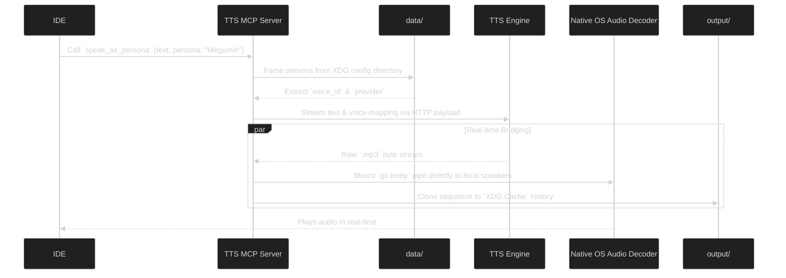

# TTS-MCP: Universal AI Voice Protocol

Text-to-Speech MCP server bridging dynamic character personas and real-time audio playback natively into Google Antigravity and other MCP-enabled IDEs, such as Cursor and Windsurf.

## Overview

TTS-MCP stands for Text-To-Speech Model Context Protocol. It exposes audio engines directly to your IDE. Rather than the AI just typing out text, you can tell the AI to "speak as" a persona, and the plugin will seamlessly synthesize and pipe the audio into your local system speakers, saving the artifact directly to your file system.

## Supported Providers

- FishAudio: `fishaudio_tts`
- ElevenLabs: `elevenlabs_tts`
- Neets AI: `neets_tts`
- PlayHT: `playht_tts`
- Cartesia: `cartesia_tts`:
- OpenAI: `openai_tts`
- Azure: `azure_tts`
- Local API: `local_tts`

## Setup

### 1. Download Release

> If you have Go 1.22+ installed, you can compile from source using `just init`

Head over to the GitHub Releases page and download the pre-compiled binary matching your OS. Extract it to a secure location (for example: `C:\mcp\tts-mcp\` or `~/.local/bin/` depending on your OS and config setup).

### 2. Configure Environment

TTS-MCP reads its API keys from an XDG `.env` file located natively inside your OS's configuration directory:

- **Windows**: `%APPDATA%\tts-mcp\.env`
- **Linux**: `~/.config/tts-mcp/.env`
- **macOS**: `~/Library/Application Support/tts-mcp/.env`

Run the included `tts-mcp-config` Interactive CLI to safely bootstrap this file, or manually create it:

```ini
FISH_AUDIO_API_KEY=your_key_here
ELEVENLABS_API_KEY=your_key_here
```

### 3. Connect to your IDE

#### Antigravity

Provide the dynamic configuration argument to Google's MCP integration UI.

```json
{
  "command": "/absolute/path/to/extracted/tts-mcp.exe"
}
```

#### Cursor

Go to `Settings -> Features -> MCP Servers`. Click `+ Add New MCP Server`.

- **Name**: tts-mcp
- **Type**: command
- **Command**: `/absolute/path/to/extracted/tts-mcp`

#### Claude Desktop

Open `claude_desktop_config.json` and append:

```json
{
  "mcpServers": {
    "tts-mcp": {
      "command": "/absolute/path/to/extracted/tts-mcp"
    }
  }
}
```

## Features

When loaded, the MCP exposes several distinct commands to the LLM:

- `<provider>_tts`: Automatically synthesized tools based on your `.env` file keys. Allows the LLM to directly synthesize raw speech on a specific platform. Example: `fishaudio_tts("text": "Hello", "voice_id": "xyz")`.
- `create_persona`: Tells the server to construct a persistent semantic mapping. The LLM can specify a character "Trope", assigning it a Voice ID and binding it to a Provider. This saves to disk.
- `speak_as_persona`: Instead of knowing raw UUIDs, the LLM can invoke `speak_as_persona("persona": "Megumin", "text": "Explosion!")`. The MCP handles routing it securely.

## Architecture



## License

[MIT](./LICENSE)
