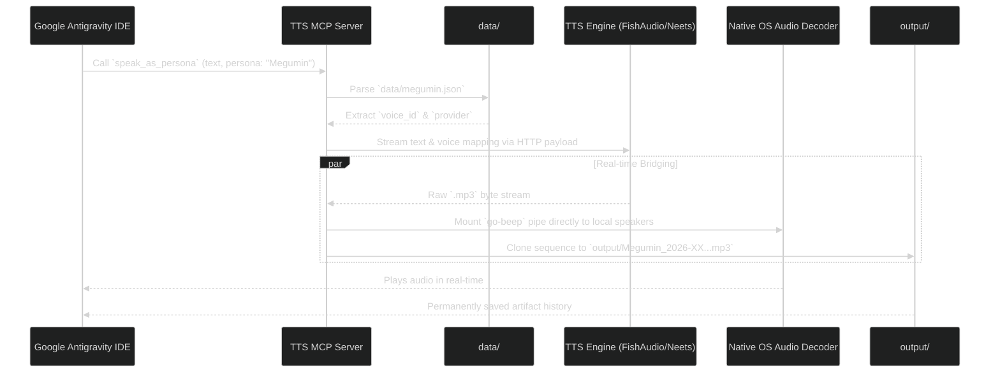

# TTS MCP

A high-performance, polyglot Text-to-Speech server bridging dynamic character personas and real-time audio playback natively into Google Antigravity and other MCP-enabled IDEs.

## Architecture & Data Flow

