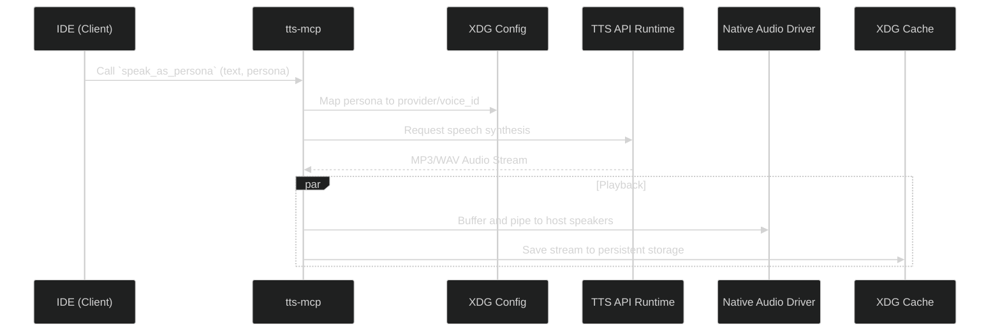

# tts-mcp

MCP server that provides Text-to-Speech capabilities. It accepts text output from LLMs, synthesizes it using remote or local audio providers, and plays it directly through the host system's native speakers.

## Features

- **Direct Playback**: Pipes synthesized audio to the host system natively.
- **Provider Aggregation**: Automatically exposes individual command tools for any configured TTS provider (`fishaudio_tts`, `elevenlabs_tts`, etc.).
- **Persona Routing**: Map specific voices and providers to semantic names to simplify LLM tool calls (`speak_as_persona`).
- **Caching**: Saves generated audio artifacts locally to an XDG cache directory.

## Supported Providers

- FishAudio
- ElevenLabs
- Neets AI
- PlayHT
- Cartesia
- OpenAI
- Azure
- Local APIs

## Installation

> Requires Go 1.22+ to build from source via `just init`

Download the pre-compiled binaries matching your OS from the [Releases](https://github.com/leo9iota/tts-mcp/releases) page.

## Configuration

`tts-mcp` requires an `.env` file in your standard OS configuration directory:

- **Windows**: `%APPDATA%\tts-mcp\.env`
- **Linux**: `~/.config/tts-mcp/.env`
- **macOS**: `~/Library/Application Support/tts-mcp/.env`

Run the included `tts-mcp-config` CLI to safely initialize this file, or populate it manually:

```ini
FISHAUDIO_API_KEY="<YOUR_API_KEY_HERE>"
ELEVENLABS_API_KEY="<YOUR_API_KEY_HERE>"
```

## Setup

You can attach the server as a standard command-line MCP tool in your preferred AI editor.

#### Antigravity and Cursor

Add the executable to your MCP Servers configuration list:

- **Name**: `tts-mcp`
- **Type**: `command`
- **Command**: `/absolute/path/to/extracted/tts-mcp`

#### Claude Code and Claude Desktop

Append to your `claude_desktop_config.json`:

```json
{
  "mcpServers": {
    "tts-mcp": {
      "command": "/absolute/path/to/extracted/tts-mcp"
    }
  }
}
```

## Architecture



## License

[MIT](./LICENSE)
