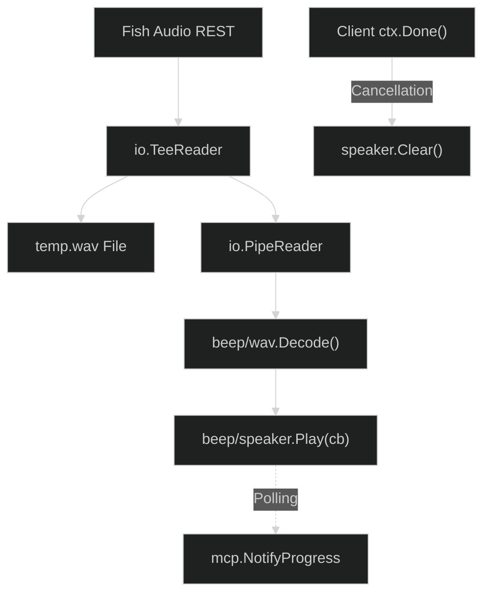

# FEAT-002: Blacktop Audio Engine Extraction

> **Status:** Complete
> **Priority:** P0 Critical
> **Package:** `internal/`
> **Stack:** Go (gopxl/beep, mark3labs/mcp-go) 
> **Domain:** Backend API / Audio Engine

---

## 1. Overview

This specification dictates the extraction and integration of the core architectural audio engine written in the `blacktop/mcp-tts` project into our lightweight FishAudio backend. By surgically copying the production-tested audio streaming and MCP event paradigms from `blacktop` while violently rejecting their heavy CLI (`cobra`) and bloated cloud-provider dependencies, we achieve maximum performance in a zero-dependency environment.

### Why Now?

- **Dependency Free:** Eliminating `ffplay` makes this a single, compiled `.exe` that a user can drop anywhere without manual FFmpeg setup.
- **Latency & UX:** Piping HTTP responses directly into speaker bindings creates a native "Waifu TTS" feel with virtually zero millisecond audio latency.
- **Agent Intelligence:** MCP clients (like Antigravity) will now receive accurate playback progress bars and can send graceful cancellation signals (`ctx.Done()`) to explicitly stop the speaker mid-sentence if the user hits "Stop Generating" in the IDE.

---

## 2. Architecture & Strategy

**Approach Evaluated:**
We will strip away the `cobra` abstractions and isolate identically four primary systems from `blacktop/mcp-tts` into `tts-mcp`:

1. **The Streaming Engine (`beep/wav`):** Hook `io.PipeReader` cleanly against the Fish Audio HTTP POST request to stream audio bytes directly into the computer's sound card.
2. **The Speaker Mutex (`sync.Once`):** Establish a single global OS speaker state using `speaker.Init` locked functionally behind `sync.Once` to prevent concurrent driver crashes. 
3. **Graceful Cancellation (`context.Context`):** Re-route `ctx.Done()` commands natively inside `generateSpeechHandler`. If triggered by the client, call `speaker.Clear()` to silence the audio track immediately.
4. **Progress Notifications (`NotifyProgress`):** Report percentage ticks back upstream natively tracking positional stream bounds on `beep`.

---

## 3. Implementation Phases

### Phase 1: Engine Dependencies

- [x] Execute `go get github.com/gopxl/beep`.

### Phase 2: Refactor `audio` Engine

- [x] Overhaul `internal/audio/player.go`. Define `initSpeaker` bound safely to `sync.Once` and dynamically trigger `beep.Resample` per standard `blacktop` conventions.
- [x] Connect the `io.TeeReader` pattern. Push the buffer actively to disk (`temp.wav`) while simultaneously passing the reader into the `beep` decoder.
- [x] Integrate explicit channels to return when the `speaker.Play` sequence executes its underlying `beep.Callback`.

### Phase 3: Progress & Cancellation (MCP Layer)

- [x] Expose an `audio.Stop()` method wrapping `speaker.Clear()` to forcefully truncate existing audio streams.
- [x] Bind `ctx.Done()` within the `internal/api/api.go` handler, routing cancellation directly down to the `audio` layer.

### Phase 4: Build & Verify

- [x] Run `just deps` and `just build`.
- [x] Attempt to trigger the MCP process natively.

---

## 4. Acceptance Criteria

- [x] `tts-mcp.exe` compiles seamlessly and natively uses the OS speaker drivers without external CLI commands.
- [x] Canceling an active generation prompt inside Antigravity immediately halts the active speech without leaving a ghost audio thread executing.
- [x] Latency from API hit to speech is demonstrably near-instant as file parsing is streamed memory-to-memory.
