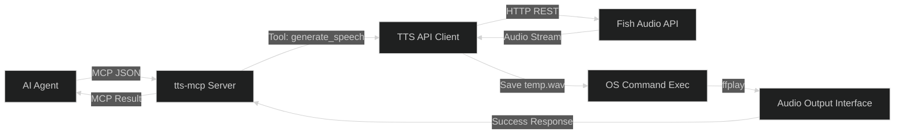

# FEAT-001: Implement Core TTS MCP Server

> **Status:** Draft
> **Priority:** P0 Critical
> **Package:** `./`
> **Stack:** Go (Golang / mcp-go)
> **Domain:** Backend API

---

## 1. Overview

This specification covers the end-to-end implementation of `tts-mcp`, a lightweight, custom Model Context Protocol (MCP) server written in Go. The server exposes a single tool (`generate_speech`) to an AI agent, allowing it to dynamically generate and play highly expressive text-to-speech using the Fish Audio REST API.

### Why Now?

- **Cost Reduction:** Provides a cheaper, anime-focused alternative to ElevenLabs.
- **Enhanced UX:** Bridges the gap between the AI agent and the host OS by allowing the agent to "speak" aloud seamlessly over standard STDIO MCP communication.
- **Agent Interactivity:** Antigravity and Claude can directly control voice ID and TTS generation dynamically without manual user playback.

---

## 2. Architecture & Strategy

**Approach:** The server will run via `stdio` using `mark3labs/mcp-go`. When the AI calls the tool, the server executes a synchronous, blocking workflow: HTTP POST to the TTS API -> Write binary to `temp.wav` -> Play audio using an external process like `ffplay` -> Return `.wav` generation result to the AI.

---

## 3. Implementation Phases

### Phase 1: Environment & Setup

- [x] Run `go mod init tts-mcp`.
- [x] Run `go get github.com/mark3labs/mcp-go` and `github.com/joho/godotenv`.
- [x] Create a `.env.example` mapping out the shape of the keys.
- [x] Create a `.env` file to hold `FISH_AUDIO_API_KEY`.
- [x] Verify `temp.wav` and `.env` are in `.gitignore` (Completed).

### Phase 2: The TTS Client

- [x] Create `tts.go` module for API interactions.
- [x] Implement a Go function to construct the HTTP POST request to the Fish Audio API.
- [x] Read the `FISH_AUDIO_API_KEY` from the environment variables.
- [x] Handle the binary audio stream response and save it to `temp.wav` in the local directory.

### Phase 3: Audio Playback

- [x] Create `playback.go` module for audio execution.
- [x] Write a Go function to execute a system command `exec.Command("ffplay", "-nodisp", "-autoexit", "temp.wav")`.
- [x] Ensure the function properly executes the OS-level audio process to seamlessly play the audio file without user intervention.

### Phase 4: The MCP Wrapper

- [x] Create `main.go`.
- [x] Initialize the `mcp.NewServer()` instance.
- [x] Register the `generate_speech` tool using `mcp.NewTool()`. The tool must define `text` (string, required) and `voice_id` (string, required).
- [x] Inside the tool handler: Call the TTS Client -> Call the Playback function -> Return a success message to the AI.
- [x] Start the stdio server (`server.ServeStdio()`).

### Phase 5: Build & Antigravity Integration

- [x] Execute `just build` to compile the Go binary (`tts-mcp.exe`).
- [x] Test the server locally using `just inspect` via MCP Inspector.
- [x] Update Antigravity's `mcp_config.json` to point the `command` directly to the new `tts-mcp.exe` file.

---

## 4. Acceptance Criteria

- [x] `tts-mcp.exe` compiles without errors.
- [x] Server successfully connects to an MCP client via STDIO and exposes the `generate_speech` tool.
- [x] Calling the `generate_speech` tool results in a valid HTTP POST to the Fish Audio API (or local equivalent).
- [x] The received audio is saved as `temp.wav` and is valid format.
- [x] The server successfully plays the audio aloud on the host machine using `ffplay` when commanded.
