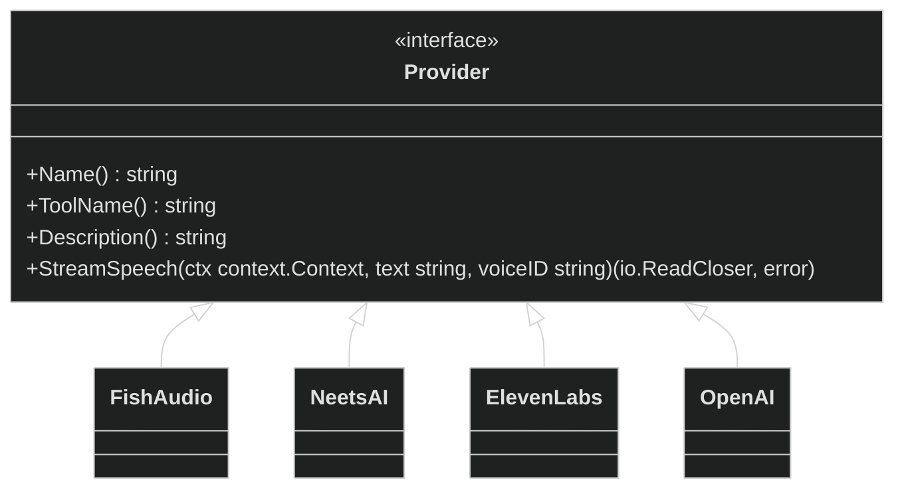

# FEAT-003: Provider Registration Architecture

> **Status:** Draft
> **Priority:** P0 Critical
> **Package:** `internal/tts/`
> **Stack:** Go (Polymorphism)
> **Domain:** Backend API / Provider Engine

---

## 1. Overview

Our `tts-mcp` currently only exposes a single globally hard-coded `generate_speech` block bound exclusively to Fish Audio. To support multiple providers simultaneously (`elevenlabs_tts`, `neets_tts`, etc.), we must extract the network streaming logic behind a uniform polymorphic interface.

### Why Now?

- **Multi-Cloud Extensibility:** The `blacktop/mcp-tts` engine supports multiple providers natively. If we replicate its success, our MCP server must be equally scalable, registering generic `StreamSpeech` blocks without needing hundreds of lines of duplicated routing handlers in `api.go`.

---

## 2. Architecture & Strategy

**Approach Evaluated:**
We will implement an explicit `Provider` interface inside `internal/tts/`. Every TTS service we integrate will map to an individual Go file (`fish.go`, `neets.go`, `elevenlabs.go`) and conform to a uniform `StreamSpeech` signature.

---

## 3. Implementation Phases

### Phase 1: The Core Interface

- [ ] Create `internal/tts/provider.go`.
- [ ] Define the exact `Provider` interface shown above.

### Phase 2: Refactoring `api.go`

- [ ] Overhaul `internal/api/api.go` to maintain a dynamic registry of tools: `var Providers []tts.Provider`.
- [ ] Implement a loop inside `Start()` that iterates over `Providers`, dynamically generating `mcp.NewTool` blocks based on the `ToolName()` and `Description()`.
- [ ] Route the `generateSpeechHandler` dynamically to look up the correct provider before executing the `io.TeeReader` sequence.

---

## 4. Acceptance Criteria

- [ ] The `internal/tts` package successfully compiles with an explicit interface type.
- [ ] The `Start()` function dynamically maps standard interface tools to the MCP server.
