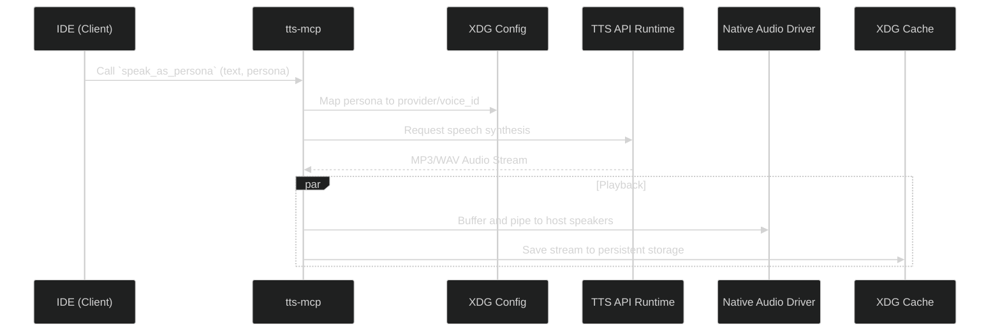

## TTS MCP Architecture

```mermaid
%%{init: {'theme': 'dark'}}%%
sequenceDiagram
    participant Client as IDE (Client)
    participant MCP as tts-mcp
    participant Config as XDG Config
    participant Provider as TTS API Runtime
    participant Audio as Native Audio Driver
    participant Cache as XDG Cache

    Client->>MCP: Call `speak_as_persona` (text, persona)
    MCP->>Config: Map persona to provider/voice_id
    MCP->>Provider: Request speech synthesis
    Provider-->>MCP: MP3/WAV Audio Stream

    par Playback
        MCP->>Audio: Buffer and pipe to host speakers
        MCP->>Cache: Save stream to persistent storage
    end
```
